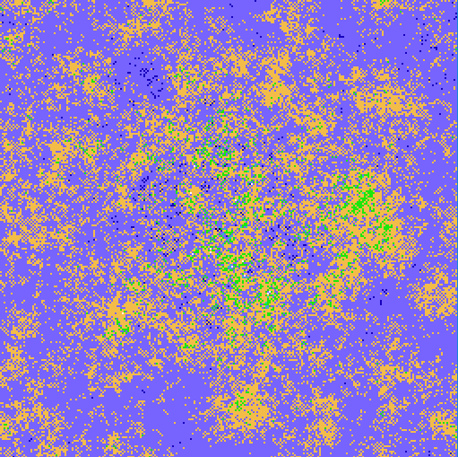
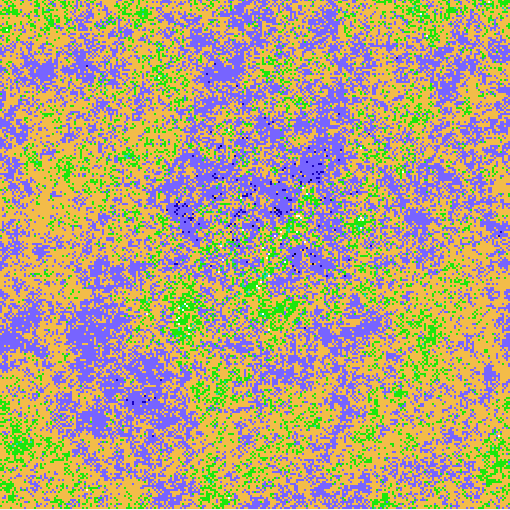
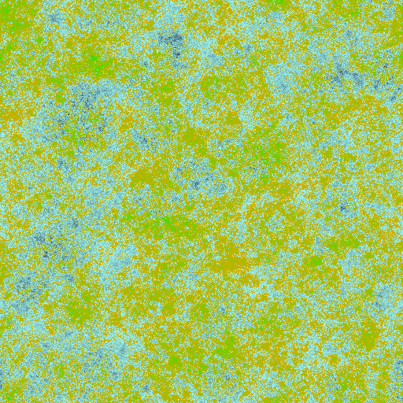
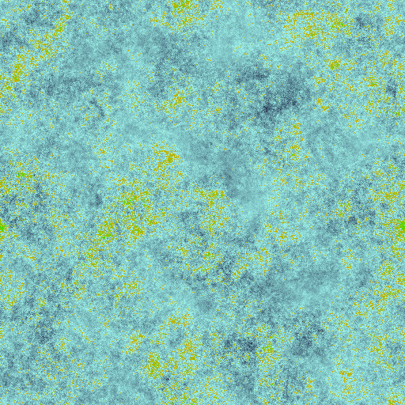
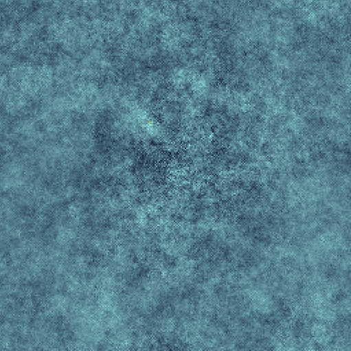
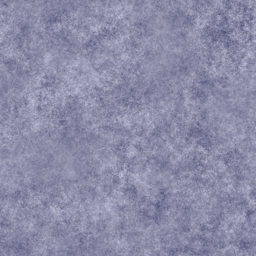

daseffect Project:
 

  Generates pseudo-random structures using discrete differential operators.
   
  Perlin noise is not used. Fog animations is available.

  
  
  
  
  
  

anyhum@yandex.ru
